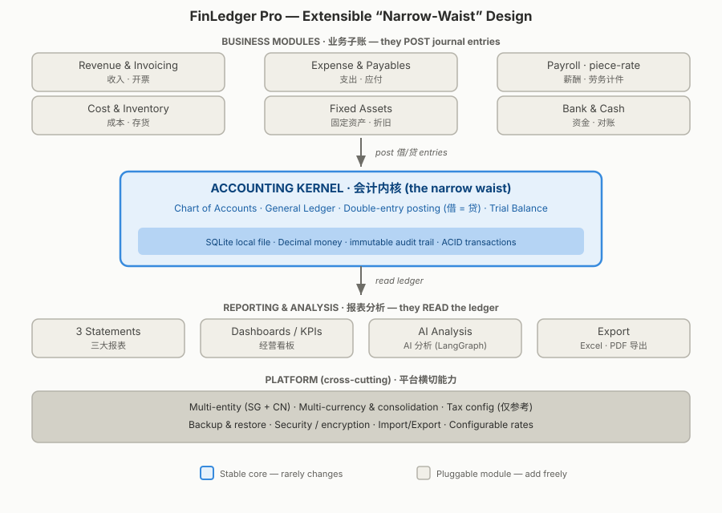

# FinLedger Pro——系统架构

[English](architecture.md) | [简体中文](architecture.zh-CN.md)

> **状态：** 设计 / 架构决策记录（ADR）
>
> **目标：** 用一个稳定、可扩展的核心同时支持个人记账和小公司的核心财务流程，不因增加业务模块而重写账本。

---

## 1. 设计问题

系统需要同时服务两类需求：

- 个人用户希望快速了解钱花到哪里，不应该被借贷术语打扰；
- 小公司需要复式记账、应收应付、标注员结算、银行对账、报表、多主体和多币种。

解决方案由两部分组成：

1. **窄腰架构：** 以小而稳定的账本作为所有业务模块和报表之间的共同接口；
2. **Basic / Pro 双模式：** 共用基础设施，但保持个人现金记账和企业权责发生制会计的概念边界。



---

## 2. 双模式与依赖边界

```text
personal/（Basic）       pro/（Pro）
个人现金记账              企业复式记账
       \                  /
        \                /
          core/ 共享核心
  账套、金额、标识、审计、迁移、备份、配置
```

依赖规则：`personal/` 和 `pro/` 都可以依赖 `core/`，但两者不能互相依赖。该规则应由目录结构和自动检查共同保护。

| 概念 | Basic | Pro |
|---|---|---|
| 账簿类型 | `PERSONAL` | `BUSINESS`，每个法律主体一套 |
| 基础 | 收付实现制 | 权责发生制 |
| 方法 | 单式现金流风格 | 复式记账，借方 = 贷方 |
| 主要记录 | 收入、支出、转账 | 源单据、凭证和日记账分录 |
| 合并 | 永不与企业账合并 | SG/CN 主体可按规则合并 |

Basic 不是试用版，也没有收费升级。早期只实现一条 Basic 流水以验证共享路径；完整 Basic 功能在首个企业月结闭环完成后继续完善。

---

## 3. 窄腰会计内核

几乎每个企业财务事件最终都会生成一组平衡分录：

```text
多个业务模块 → 一个复式记账账本 → 多种报表与分析
  生成分录         检查并保存          只读账本
```

- 发票、账单、外部付款会计记录、结算和固定资产是**子账模块**；
- 会计内核只接受满足借贷平衡和状态规则的分录；
- 试算平衡和报表只读取账本，不直接读取各模块并自行重新计算会计事实；
- 多主体、多币种、备份、安全、导入导出和开放 API 是跨模块能力。

新增财务功能通常只需增加一个源单据、状态机和过账规则；总账不需要理解这个模块的业务细节。

### 3.1 公开核心与公司私有扩展

同样的边界也适用于仓库。FinLedger Pro 公开可复用的会计内核、发票及会计工作流、对账引擎、只读银行流水契约、参考应用和扩展测试。公司另建私有仓库，保存品牌、科目映射、内部流程和供应商配置，并依赖公开核心的正式版本：

```text
公司私有仓库 → FinLedger Pro 公开核心
```

公开核心不能反向依赖私有代码。扩展只能通过公开命令过账、通过公开查询服务读取，私有数据表与迁移也不能直接修改核心账本表。优先使用版本化依赖，不长期维护私有 fork。完整规则见[公开核心与公司私有仓库](public-core-and-private-company-repos.zh-CN.md)。

---

## 4. 四层结构

### 4.1 业务子账

| 模块 | 责任 |
|---|---|
| 个人账本 | 账户、分类、收入、支出、转账、预算和消费分析 |
| 联系人与单据 | 客户、供应商、承包者、附件和状态历史 |
| 收入与开票 | 合同、发票、应收、收款和收入确认 |
| 费用与应付 | 采购/费用、账单、应付、外部付款记录和报销 |
| 用工结算 | 标注成果、质量验收、计件单价、结算和代扣信息 |
| 项目成本 | 项目维度、成本分配、收入和毛利 |
| 银行与现金 | 文件/API 流水只读导入、查重、匹配、资金记录和对账 |
| 固定资产 | 资产台账、折旧和处置 |

### 4.2 共享核心与企业会计内核

`core/` 负责账套、标识、`Decimal` 金额、货币、事务、审计、配置、迁移和备份。

`pro/accounting/` 负责科目表、日记账、复式过账、试算平衡、会计期间和锁定。

### 4.3 报表与分析

个人报表包括消费结构、储蓄率、预算和净资产；企业报表包括利润表、资产负债表、现金流量表、账龄、项目利润和银行对账报告。每一个报表数字都必须能够下钻到凭证、源单据和附件。

### 4.4 平台能力

包括多账套、多主体、多币种、只读银行/汇率适配器、本地缓存、税务参考配置、导入导出、备份恢复、加密和诊断。任何供应商契约都不能发起或批准资金移动。

---

## 5. 五个扩展点

### 5.1 统一过账接口

每种源单据把自身业务事实转换为分录：

```text
contractor_settlement.post()
  借：数据标注劳务成本
  贷：应付劳务结算款
```

过账必须是原子操作，并通过幂等键避免重复执行。

### 5.2 配置优于硬编码

科目映射、税率、社保规则、计件单价、汇率来源和舍入规则都采用带生效日期和来源的版本配置。修改当前配置不能改变历史计算。

### 5.3 多主体和多币种从第一天进入模型

每条企业记录携带 `entity_id` 或 `book_id` 和货币信息。每套企业账簿有一个本位币；每笔外币交易保留原币、本位币、汇率和来源快照。详细规则见[开放 API 与多币种策略](open-api-and-multi-currency.zh-CN.md)。

### 5.4 源单据、附件和审计轨迹

真实业务先形成源单据，再生成会计凭证。单据可以关联合同、发票、银行回单、验收记录等附件，并保存谁在何时执行了什么操作。

### 5.5 显式状态、银行对账和月结控制

```text
DRAFT → APPROVED → POSTED → PAID / SETTLED
                          ↘ REVERSED / CREDITED
```

非法状态转换必须被拒绝。银行流水先暂存、查重再匹配；每次匹配保存证据。会计期间关闭后，普通操作不能修改该期间，解锁必须记录原因。

`PAID` 表示外部证据证明资金已经移动，不表示 FinLedger Pro 发起付款。银行接口只提供账户、余额、流水、游标和健康检查；不会出现创建转账、管理收款人、批量付款、自动扣款、收款、退款或银行卡控制方法。

---

## 6. 数据标注计件示例

推荐数据关系：

```text
annotator
  relation_type          # 用工关系
  pay_method             # PIECE_RATE | HOURLY | MONTHLY

project
  unit_type
  default_unit_price     # Decimal
  quality_rule

output_record
  submitted_qty
  accepted_qty
  rejected_qty
  unit_price_snapshot    # Decimal
  amount                 # accepted_qty × unit_price_snapshot
  settlement_id

settlement
  gross_amount
  tax_withheld
  net_amount
  journal_entry_id
```

会计分录示例：

```text
确认结算成本：
  借：劳务成本 / 项目成本       gross
  贷：应付劳务结算款            gross

实际付款：
  借：应付劳务结算款            gross
  贷：银行存款                  net
  贷：应交代扣税费              tax
```

必须按合格数量计件，保存单价历史快照，并保证每条产量记录只能进入一张有效结算单。软件中的关系类型只是业务配置，不能替代对实际用工性质的法律判断。

---

## 7. 建设顺序

```text
本地可靠基础 + 一条个人流水
→ 企业会计内核
→ 联系人与源单据
→ 费用、计件结算和应付
→ 只读银行导入与对账
→ 收入、发票和收款
→ 月结与三大报表
→ 项目利润、多币种和 SG/CN 多主体
→ 完整个人财务
→ 可选税务参考和 AI
```

银行对账放在收入模块之前并不表示收入不重要，而是因为对账负责证明“账上现金等于银行事实”，它是系统能否用于真实账目的早期可靠性门槛。

---

## 8. 非目标

FinLedger Pro 不试图取代 HR、CRM、法律管理、银行、支付服务、法定申报或完整 ERP。系统会制作发票、记录账单与应收应付、读取银行流水并完成对账，但不会发起、批准、排程或执行付款，也不会签发或控制银行卡。资金移动始终在银行或其他独立受控服务中完成。

---

## 9. 相关文档

- [中文 README](../README.zh-CN.md)
- [中文产品路线图](product-roadmap.zh-CN.md)
- [中文 Xero 功能借鉴](xero-product-benchmark.zh-CN.md)
- [中文开放 API 与多币种策略](open-api-and-multi-currency.zh-CN.md)
- [公开核心与公司私有仓库](public-core-and-private-company-repos.zh-CN.md)
